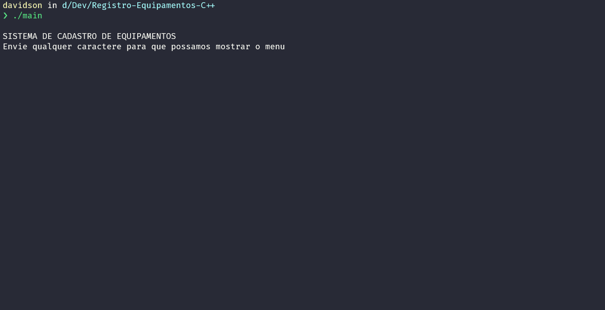

<h1 align="center">Sistemas de Registro de Equipamentos</h1>

<!-- ABOUT -->
<h3>Sobre</h3>

Este programa simula um sistema de registro de equipamentos com diversas funções na linguagem C++. Foi desenvolvido utilizando diversos conceitos de programação orientada a objetos (POO). Todo sistema foi baseado em CRUD, que significa "Create" (Criar), "Read" (Pesquisar), "Update" (Atualizar) e "Delete" (Deletar).   
Ele possui um menu que realiza as seguintes funções:

<ul>
  <li>
    <h4>CRUD de um tipo de equipamento ✔</h4>
    
  </li>
</ul>

<h4>Este programa foi feito na linguagem C++.</h4>